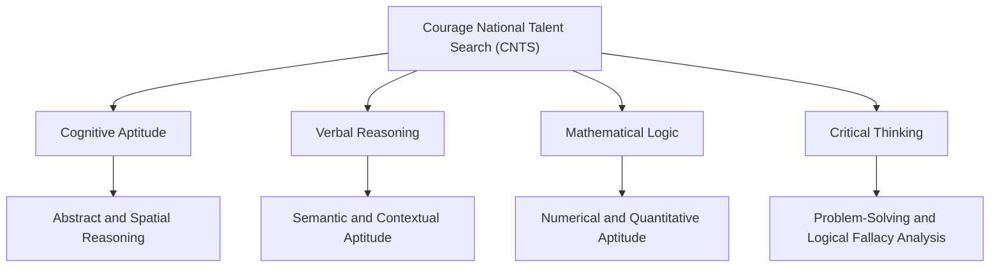

In an era of rapid technological advancement and changing job markets, the skills required by the next generation of students are undergoing a fundamental shift. For decades, traditional educational systems have relied heavily on rote memorization—the ability to store factual information temporarily and reproduce it during exams. While this method produces disciplined learners, it often fails to measure a student’s true analytical potential, raw problem-solving skills, and cognitive flexibility. 

To bridge this critical gap and provide an objective, scientifically validated assessment of student potential, Courage Library introduced a landmark national initiative. The **Courage National Talent Search (CNTS)** is an official program operated by [Courage Library](/about) designed to transition the focus of student evaluation from memorized syllabus recall to higher-order cognitive development. By evaluating core thinking processes rather than school curriculum alignment, CNTS serves as a national benchmark that identifies latent talent, aids parent-teacher planning, and assists schools in structuring modern, data-driven pedagogy.

Whether you are a parent looking to help your child navigate their future academic path or an educator seeking to measure real problem-solving capabilities, this comprehensive guide provides a complete overview of the CNTS framework, its core assessment pillars, registration accessibility, and diagnostic outcomes.

---

## The Pedagogical Shift: Rote Learning vs. Cognitive Diagnostics

Traditional school examinations are, by design, curriculum-bound. Whether a student is enrolled in CBSE, ICSE, IB, or various State Boards, their final score is heavily determined by their mastery of specific textbook chapters. Under this model, intense coaching, repetitive drills, and a strong short-term working memory are the primary keys to success. 

However, high academic grades do not always correlate with high cognitive potential. Rote-heavy exams test what a student knows at a single point in time, whereas cognitive diagnostics measure how a student processes new, unfamiliar information.

We can analyze this pedagogical difference through the framework of **Bloom's Taxonomy**, which classifies learning objectives into levels of cognitive complexity:

```
       ▲  [ Create ]      - Formulating new structures or patterns
      / \ [ Evaluate ]    - Critiquing, checking, and making judgments
     /   \ [ Analyze ]     - Deconstructing elements, identifying relationships
    /     \ [ Apply ]       - Transferring concepts to unfamiliar situations
   /       \ [ Understand ] - Explaining ideas, translation, and interpreting
  /_________\ [ Remember ]   - Retrieving, recalling, and rote memorizing
```

Traditional school assessments rarely venture beyond the bottom two tiers of Bloom's Taxonomy: *Remembering* and *Understanding*. When students cram for a standard history or science test, they primarily exercise recall. 

In contrast, the [Courage National Talent Search](/cnts) is engineered to assess the middle and upper tiers: *Applying*, *Analyzing*, and *Evaluating*. Instead of asking a student to recall a specific mathematical formula, CNTS presents a novel sequence of shapes or numbers and asks the student to deduce the underlying relationship. This measures **fluid intelligence** (the capacity to think logically and solve problems in novel situations, independent of acquired knowledge) rather than **crystallized intelligence** (which is heavily influenced by schooling, coaching, and cultural background).

As students advance to higher education and face highly competitive national entrance exams (such as JEE, NEET, CAT, CLAT, or UPSC), they are confronted with complex, non-textbook problems. Students who have relied purely on memorization often struggle, while those with strong cognitive foundations excel. CNTS acts as an early diagnostic tool, pinpointing cognitive strengths and growth areas before students face these high-stakes milestones.

---

## Decoding the Assessment: The Four Core Sections

The CNTS assessment does not require students to study textbook chapters or memorize factual trivia. Instead, the test is divided into four modules, each meticulously designed to map a distinct cognitive domain:



### 1. Cognitive Aptitude (Abstract & Spatial Reasoning)
This section evaluates a student's ability to process non-verbal, visual information. Questions involve mental rotation, pattern synthesis, matrix completion, and spatial folding.
* **Why it matters**: Abstract reasoning is a primary indicator of fluid intelligence. It reveals how well a student can identify rules and relationships in unfamiliar visual data. This domain is highly correlated with success in STEM (Science, Technology, Engineering, and Math) fields, architecture, software engineering, and spatial design.
* **How it differs from school exams**: While a school geometry exam tests the memorized formulas for calculating a shape's area or volume, the CNTS spatial section tests the student’s raw ability to mentally manipulate objects and understand spatial arrangements.

### 2. Verbal Reasoning (Semantic & Contextual Aptitude)
Verbal Reasoning moves past standard spelling bees and memorized grammar rules. It evaluates contextual comprehension, verbal analogies, vocabulary in context, and logical flow within a text.
* **Why it matters**: Strong verbal reasoning indicates a student's capacity for logical argument, comprehension of complex instructions, and effective communication. It forms the foundation for humanities, law, journalism, public relations, and business management.
* **How it differs from school exams**: Traditional English exams test a student's ability to recall specific stories or poems from their school textbooks. CNTS verbal ability evaluates their capacity to deconstruct unfamiliar texts, identify logical fallacies, and deduce semantic connections.

### 3. Mathematical Logic (Numerical Aptitude)
Rather than arithmetic speed or formula retrieval, this section evaluates quantitative logic, sequence relationships, and numerical reasoning.
* **Why it matters**: Numerical aptitude is not about how quickly a student can perform long-division calculations. It is about understanding the fundamental properties of numbers, detecting structural sequences, and applying quantitative logic to real-world scenarios.
* **How it differs from school exams**: School math exams evaluate the execution of memorized algorithms (e.g., step-by-step algebraic expansion). CNTS mathematical logic focuses on puzzles, number properties, and logical deduction where the algorithm itself must be discovered by the student.

### 4. Critical Thinking (Problem-Solving & Decision Making)
This module evaluates a student's capacity to analyze premises, evaluate the strength of arguments, distinguish between correlation and causation, and draw valid conclusions from a set of statements.
* **Why it matters**: In an information-rich world, the ability to filter out noise, evaluate evidence, and make logical decisions is one of the most critical life skills. It forms the core of leadership, scientific inquiry, and strategic planning.
* **How it differs from school exams**: Traditional school curricula rarely teach or test formal logic or argument analysis. CNTS fills this critical gap, ensuring that students can think independently and critique information objectively.

### Summary Comparison: School Exams vs. CNTS

| Feature | Typical School Exams | Courage National Talent Search (CNTS) |
| :--- | :--- | :--- |
| **Primary Goal** | Assess mastery of a specific curriculum/syllabus. | Measure foundational cognitive potential and reasoning ability. |
| **Preparation Style** | Intense revision, rote memorization, past papers. | No active preparation needed; focuses on raw thinking capability. |
| **Cognitive Level** | Lower-order skills (Remembering & Recalling). | Higher-order skills (Analyzing, Applying, Evaluating). |
| **Feedback Provided** | Raw marks, grades, and class rank. | Granular Cognitive Profile Report detailing specific skill indices. |
| **Long-Term Utility** | High-school progress tracking. | Guidance for stream selection, competitive exams, and career paths. |

---

## Democratizing Education: The ₹99 Access Model

One of the major barriers to quality education in India is the high cost of standardized aptitude assessments. Historically, comprehensive cognitive profiling, psychological testing, and talent searches have been expensive services, often costing thousands of rupees. This pricing model restricted access to students from elite private schools in tier-1 cities, leaving millions of bright minds in tier-2, tier-3 cities, and rural areas without the means to identify their latent potential.

Courage Library was founded on the belief that talent is evenly distributed, but opportunity is not. To democratize access to world-class cognitive testing, the registration fee for the CNTS has been set at an affordable **₹99**. 

By keeping the fee at this nominal level, CNTS ensures that every family, regardless of their economic background, can afford to benchmark their child's intellectual development. Whether a student is studying in a government-aided school in a small town or a premium academy in a metropolitan area, they sit for the exact same test, receive the exact same high-quality report, and gain the exact same recognition.

Parents can register their children directly through the secure digital [registration portal](/register) in under three minutes, allowing them to unlock these powerful cognitive insights without any financial strain.

---

## Actionable Outcomes: What Students, Parents, and Schools Receive

The CNTS is designed to go beyond testing. Every assessment is structured to lead to actionable, developmental outcomes that shape a student's academic future.

### 1. The Student Cognitive Profile Report
Rather than receiving a simple percentage or a single pass/fail grade, students are provided with a highly detailed, multi-page **Cognitive Profile Report**. This report breaks down performance across all four core domains, presenting detailed scores and national percentile rankings.
* **Stream and Career Guidance**: As students approach Class 9 and 10, they face the crucial decision of stream selection (Science, Commerce, or Humanities). The Cognitive Profile Report provides an empirical map of their underlying strengths. A student with high spatial and mathematical logic but moderate verbal reasoning may excel in engineering, architecture, or computer science, while a student with exceptional verbal logic and critical thinking may find a perfect fit in law, journalism, or public policy.
* **Targeted Learning Action Plans**: The report highlights specific growth areas, giving parents and tutors clear guidelines on where the student needs support. For instance, if the report shows a deficit in verbal reasoning, the family can focus on reading habits and semantic exercises rather than generic tutoring.

### 2. Verified Merit Digital Certificates
Every student who participates is awarded a certificate, with high achievers receiving special merit distinctions. These certificates are digitally signed, secure, and contain a unique verification link. Students can showcase these certificates in their academic portfolios, applications, and scholarship submissions as a verified testament to their cognitive talent.

### 3. Institutional Cognitive Dashboards for Schools
Through the [For Schools](/for-schools) portal, partner institutions receive aggregated dashboards. Instead of evaluating individual students, principals and academic coordinators can view cohort-level trends. If an entire grade level shows a dip in spatial reasoning, the school can introduce tactile STEM tools or geometry visualization exercises. This feedback loop helps schools continuously refine their curriculum to match global standards.

---

## Frequently Asked Questions (FAQ)

Here are the answers to some of the most common questions about the Courage National Talent Search:

**Q1: Which students are eligible to participate in the CNTS?**
* **Answer**: The CNTS is open to students across India from Class 5 to Class 10. The test is dynamically adjusted for each grade level, ensuring that the questions are developmentally appropriate while remaining cognitively challenging.

**Q2: How should a student prepare for the CNTS?**
* **Answer**: Because the CNTS evaluates fluid intelligence and cognitive aptitude rather than memorized content, there is no need for intensive rote preparation or specialized coaching. Students can prepare by engaging in logical puzzles, reading widely, solving non-verbal logic riddles, and taking the official mock test available on the [Courage National Talent Search landing page](/cnts).

**Q3: Can schools register their students in bulk?**
* **Answer**: Yes. Schools can register as institutional partners through the dedicated [For Schools portal](/for-schools). Once registered, coordinators gain access to a free dashboard that allows for bulk Excel/CSV uploads of student rosters, making the entire registration process simple and seamless.

**Q4: How and where is the assessment conducted?**
* **Answer**: The CNTS is a digital assessment that can be taken online from any computer, tablet, or smartphone with a stable internet connection. The portal includes advanced digital proctoring features to ensure the integrity of the test while making it convenient for students to take the exam from the comfort of their homes or schools.

---

## Conclusion: Nurturing the Thinkers of Tomorrow

The future of learning belongs to those who can think, adapt, and solve problems in real-time. By moving away from rote memorization and towards cognitive profiling, the Courage National Talent Search (CNTS) is paving the way for a more analytical, capable, and confident generation.

For just ₹99, parents and schools can gain access to an empirical roadmap of a student's cognitive architecture, unlocking insights that can shape their academic and career success for years to come. Take the first step in measuring and nurturing real potential—visit the [registration portal](/register) to secure a slot, or explore the [About page](/about) to learn more about Courage Library’s mission to elevate Indian education.
